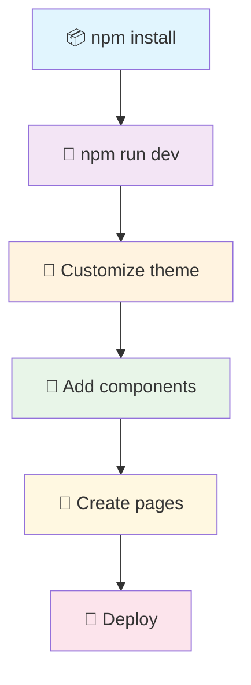

# 🗺️ MapMaker Test

> **Nowoczesna aplikacja webowa** zbudowana z myślą o profesjonalnym rozwoju i skalowalności

<div align="center">


</div>

## ✨ Dlaczego MapMaker Test?

Ten projekt to **więcej niż starter template** - to **kompletne rozwiązanie** dla nowoczesnych aplikacji webowych. Łączy najlepsze praktyki development-u z eleganckim designem Material-UI.

### 🎯 **Główne zalety:**
- 🚀 **Błyskawiczny start** - wszystko skonfigurowane out-of-the-box
- 🎨 **Piękny design** - Material-UI z custom theme
- 💪 **Type Safety** - pełna integracja TypeScript
- 📱 **Responsive** - działa na wszystkich urządzeniach  
- 🔧 **Developer Friendly** - zorganizowana struktura i narzędzia

## �️ Tech Stack

| Technologia | Wersja | Zastosowanie |
|------------|--------|--------------|
| **Next.js** | `14.0` | Framework React z App Router |
| **TypeScript** | `5.2` | Type safety i lepsza DX |
| **Material-UI** | `5.14` | Kompletny system designu |
| **Emotion** | `11.11` | CSS-in-JS styling |
| **ESLint** | `8.54` | Code quality i consistency |

## � Architektura Projektu

Profesjonalnie zorganizowana struktura folderów, inspirowana najlepszymi praktykami enterprise development:

<details>
<summary><strong>📁 Kliknij aby zobaczyć pełną strukturę</strong></summary>

```bash
mapmaker_test/
├── 📁 .github/                 # GitHub configuration
│   └── copilot-instructions.md # AI assistant guidelines
├── 📁 public/                  # Static assets
├── 📁 src/                     # Source code
│   ├── 📁 app/                 # 🎯 Next.js App Router
│   │   ├── globals.css         #    Global styles
│   │   ├── layout.tsx          #    Root layout
│   │   └── page.tsx            #    Homepage
│   ├── 📁 components/          # 🧩 React Components
│   │   ├── 📁 layout/          #    Layout components
│   │   │   ├── Header.tsx      #    Navigation header
│   │   │   └── Footer.tsx      #    Site footer
│   │   ├── 📁 providers/       #    Context providers
│   │   │   └── MaterialUIProvider.tsx
│   │   └── 📁 ui/              #    Reusable UI components
│   │       └── LoadingCard.tsx #    Loading state component
│   ├── 📁 config/              # ⚙️ Configuration
│   │   └── theme.ts            #    Material-UI theme
│   ├── 📁 hooks/               # 🎣 Custom React Hooks
│   │   └── index.ts            #    useLocalStorage, useDebounce
│   ├── 📁 lib/                 # 📚 Third-party integrations
│   │   └── api.ts              #    API client utilities
│   ├── 📁 styles/              # 🎨 Global styles
│   ├── 📁 types/               # 📋 TypeScript definitions
│   │   └── index.ts            #    Common interfaces
│   └── 📁 utils/               # 🔧 Utility functions
│       └── index.ts            #    Helper functions
├── .env.example                # Environment variables template
├── .eslintrc.json             # Code quality rules
├── .gitignore                 # Git ignore patterns
├── next.config.js             # Next.js configuration
├── next-env.d.ts              # Next.js TypeScript definitions
├── package.json               # Dependencies & scripts
├── README.md                  # Project documentation
└── tsconfig.json              # TypeScript configuration
```

</details>

### 🏗️ **Dlaczego taka struktura?**

- **📱 `app/`** - Next.js 14 App Router dla nowoczesnego routingu
- **🧩 `components/`** - Podział na layout, providers i UI components
- **⚙️ `config/`** - Centralna konfiguracja (theme, constants)
- **🎣 `hooks/`** - Custom hooks dla logiki wielokrotnego użytku
- **📚 `lib/`** - Integracje z zewnętrznymi serwisami
- **📋 `types/`** - TypeScript definitions w jednym miejscu
- **🔧 `utils/`** - Pure functions bez side effects

## � Quick Start

### Wymagania
- **Node.js 18+** 
- **npm** lub **yarn**

### 3 kroki do uruchomienia:

```bash
# 1️⃣ Zainstaluj dependencies
npm install

# 2️⃣ Uruchom development server  
npm run dev

# 3️⃣ Otwórz w przeglądarce
# http://localhost:3000
```

<div align="center">

**🎉 Voilà! Twoja aplikacja działa na `localhost:3000`**

</div>

### 🔧 Alternatywnie z yarn:
```bash
yarn install && yarn dev
```

## 📦 Available Scripts

- `npm run dev` - Start development server
- `npm run build` - Build for production
- `npm run start` - Start production server
- `npm run lint` - Run ESLint
- `npm run type-check` - Run TypeScript type checking

## 🎨 Material-UI - Gotowe do użycia!

### 🌈 **Kompletna konfiguracja designu**

<table>
<tr>
<td width="50%">

**🎯 Theme System**
- ✅ Custom colors & palette
- ✅ Typography scale 
- ✅ Component overrides
- ✅ Responsive breakpoints
- 🔄 Light/Dark mode ready

</td>
<td width="50%">

**🧩 Przykładowe komponenty**
- ✅ Header z nawigacją
- ✅ Footer z linkami  
- ✅ Loading states
- ✅ Material-UI Provider
- ✅ Responsive layout

</td>
</tr>
</table>

### 💡 **Jak używać Material-UI?**

```tsx
// Importuj komponenty MUI
import { Button, Card, Typography, Box } from '@mui/material';
import { Home as HomeIcon } from '@mui/material/icons-material';

// Używaj w swoich komponentach
export default function MyComponent() {
  return (
    <Card sx={{ p: 3 }}>
      <Box display="flex" alignItems="center" gap={1}>
        <HomeIcon color="primary" />
        <Typography variant="h5">Ładny design!</Typography>
      </Box>
      <Button variant="contained" fullWidth>
        Kliknij mnie
      </Button>
    </Card>
  );
}
```

## ✨ Kluczowe Features

<div align="center">

### 🎁 **Co otrzymujesz out-of-the-box?**

</div>

| Feature | Opis | Status |
|---------|------|--------|
| 🏗️ **Professional Architecture** | Scalable folder structure + separation of concerns | ✅ Ready |
| 🎨 **Material-UI Integration** | Complete theme system + 140+ components | ✅ Ready |
| 💎 **TypeScript Everything** | Full type safety + IntelliSense support | ✅ Ready |
| 🎣 **Custom Hooks** | `useLocalStorage`, `useDebounce`, `useMediaQuery` | ✅ Ready |
| 🔧 **Utility Functions** | Date formatting, validation, API client | ✅ Ready |
| 📱 **Responsive Design** | Mobile-first + MUI breakpoints | ✅ Ready |
| ⚡ **Developer Experience** | ESLint + Path aliases + Auto-complete | ✅ Ready |
| 🌙 **Dark/Light Theme** | Theme switching foundation | 🔄 Setup ready |

### 🚀 **Dlaczego to ma znaczenie?**

<table>
<tr>
<td width="33%">

**⚡ Szybkość**
- Zero konfiguracji
- Instant development 
- Best practices wbudowane

</td>
<td width="33%">

**📈 Skalowalność** 
- Enterprise-grade structure
- Modular components
- Type-safe codebase

</td>
<td width="33%">

**😍 Developer Joy**
- Intuitive organization
- Great IntelliSense
- Modern tooling

</td>
</tr>
</table>

## 🔧 Configuration Files

### TypeScript (`tsconfig.json`)
- Strict mode enabled
- Path aliases configured (`@/` prefix)
- Next.js optimized settings

### ESLint (`.eslintrc.json`)
- Next.js recommended rules
- TypeScript specific rules
- Custom rule overrides

### Next.js (`next.config.js`)
- Material-UI Emotion compiler
- App Router enabled
- Production optimizations

## 💡 Przykłady Użycia

### 🎨 **Material-UI Components**

<details>
<summary><strong>Kliknij aby zobaczyć przykłady</strong></summary>

```tsx
import { 
  Button, Card, Typography, Box, Stack, Chip 
} from '@mui/material';
import { Star as StarIcon } from '@mui/material/icons-material';

export default function BeautifulCard() {
  return (
    <Card elevation={3} sx={{ p: 3, borderRadius: 2 }}>
      <Stack spacing={2}>
        <Box display="flex" alignItems="center" gap={1}>
          <StarIcon color="primary" />
          <Typography variant="h5" fontWeight="bold">
            Awesome Feature
          </Typography>
          <Chip label="New" color="secondary" size="small" />
        </Box>
        
        <Typography color="text.secondary">
          Material-UI makes beautiful interfaces effortless!
        </Typography>
        
        <Button 
          variant="contained" 
          fullWidth 
          sx={{ borderRadius: 2 }}
        >
          Try it now
        </Button>
      </Stack>
    </Card>
  );
}
```

</details>

### 🎣 **Custom Hooks Power**

<details>
<summary><strong>Gotowe do użycia hooks</strong></summary>

```tsx
import { useLocalStorage, useDebounce, useMediaQuery } from '@/hooks';

function SmartComponent() {
  // 💾 Persistent state w localStorage  
  const [theme, setTheme] = useLocalStorage('theme', 'light');
  
  // ⏱️ Debounced search
  const [search, setSearch] = useState('');
  const debouncedSearch = useDebounce(search, 300);
  
  // 📱 Responsive behavior
  const isMobile = useMediaQuery('(max-width: 768px)');
  
  return (
    <Box>
      <Typography>Theme: {theme}</Typography>
      <Typography>Search: {debouncedSearch}</Typography>
      <Typography>Device: {isMobile ? 'Mobile' : 'Desktop'}</Typography>
    </Box>
  );
}
```

</details>

### 🔧 **Utility Functions**

<details>
<summary><strong>Pomocne narzędzia</strong></summary>

```tsx
import { formatDate, isValidEmail, formatCurrency, debounce } from '@/utils';

// 📅 Date formatting
const today = formatDate(new Date(), 'pl-PL'); // "29 września 2025"

// ✉️ Email validation  
const isValid = isValidEmail('user@example.com'); // true

// 💰 Currency formatting
const price = formatCurrency(1234.56, 'PLN', 'pl-PL'); // "1 234,56 zł"

// ⏱️ Debounce expensive operations
const debouncedSave = debounce(saveToDatabase, 500);
```

</details>

## 🚀 Deployment - Gotowy na produkcję!

<div align="center">

### **3 sposoby na deploy w kilka minut**

</div>

<table>
<tr>
<td width="33%">

### 🔵 **Vercel** (Zalecane)
```bash
npm run build
vercel --prod
```
**Zero-config deployment** 
Perfect for Next.js! ⚡

</td>
<td width="33%">

### ⚫ **Netlify**
```bash
npm run build
netlify deploy --prod --dir=out
```
**Static export** 
Great for JAMstack! 🔥

</td>
<td width="33%">

### 🐳 **Docker**
```bash
docker build -t mapmaker .
docker run -p 3000:3000 mapmaker
```
**Containerized** 
Works everywhere! 📦

</td>
</tr>
</table>

### 📊 **Build Stats**
- ✅ **Optimized bundles** dzięki Next.js 14
- ✅ **Tree shaking** - tylko używany kod  
- ✅ **Material-UI optimization** - automatic bundle splitting
- ✅ **TypeScript checking** podczas build

## 🔗 Useful Links

- [Next.js Documentation](https://nextjs.org/docs)
- [Material-UI Documentation](https://mui.com/material-ui/getting-started/)
- [TypeScript Documentation](https://www.typescriptlang.org/docs/)
- [React Documentation](https://react.dev/)

## 🤝 Contributing

1. Fork the repository
2. Create your feature branch (`git checkout -b feature/AmazingFeature`)
3. Commit your changes (`git commit -m 'Add some AmazingFeature'`)
4. Push to the branch (`git push origin feature/AmazingFeature`)
5. Open a Pull Request

## 📄 License

This project is licensed under the MIT License.

---

## � Następne Kroki

<div align="center">

### **Twój roadmap do sukcesu!** 🗺️

</div>



### ✅ **TODO Checklist**

- [ ] 📦 **Zainstaluj dependencies** - `npm install`
- [ ] 🎨 **Dostosuj theme** w `src/config/theme.ts` 
- [ ] 🧩 **Dodaj swoje komponenty** w `src/components/`
- [ ] 📄 **Stwórz nowe strony** w `src/app/`
- [ ] 🔐 **Skonfiguruj .env.local** (jeśli potrzebne)
- [ ] 🚀 **Deploy na Vercel** dla świata!

<div align="center">

### 🎊 **Happy Coding!**

*Zbuduj coś niesamowitego z MapMaker Test* ✨

[](https://github.com)
[](https://nextjs.org/)

</div>