# 🗺️ MapMaker Test - GIS Layer Management App

> **Profesjonalna aplikacja GIS** z zaawansowanym systemem zarządzania warstwami i intuicyjnym interfejsem

<div align="center">


</div>

## ✨ O Aplikacji

Ta aplikacja to **zaawansowany system GIS** z profesjonalnym interfejsem do zarządzania warstwami geograficznymi. Inspirowany najlepszymi rozwiązaniami branżowymi, oferuje intuicyjne narzędzia do pracy z danymi przestrzennymi.

### 🎯 **Kluczowe funkcje:**
- �️ **Hierarchiczne menu warstw** z grupami i podgrupami
- 🔄 **Drag & Drop** z precyzyjnym pozycjonowaniem
- 👁️ **Zarządzanie widocznością** warstw i grup
- � **Wyszukiwanie** warstw w czasie rzeczywistym
- 📱 **Responsive design** dostosowany do wszystkich urządzeń  
- ⚡ **Intuitive UX** wzorowany na profesjonalnych narzędziach GIS

## �️ Tech Stack

| Technologia | Wersja | Zastosowanie |
|------------|--------|--------------|
| **Next.js** | `14.0` | Framework React z App Router |
| **TypeScript** | `5.2` | Type safety i lepsza DX |
| **Material-UI** | `5.14` | Kompletny system designu |
| **Emotion** | `11.11` | CSS-in-JS styling |
| **ESLint** | `8.54` | Code quality i consistency |

## � Architektura Projektu

Profesjonalnie zorganizowana struktura folderów, inspirowana najlepszymi praktykami enterprise development:

<details>
<summary><strong>📁 Kliknij aby zobaczyć pełną strukturę</strong></summary>

```bash
mapmaker_test/
├── 📁 .github/                 # GitHub configuration
│   └── copilot-instructions.md # AI assistant guidelines
├── 📁 public/                  # Static assets
├── 📁 src/                     # Source code
│   ├── 📁 app/                 # 🎯 Next.js App Router
│   │   ├── globals.css         #    Global styles
│   │   ├── layout.tsx          #    Root layout
│   │   └── page.tsx            #    Homepage
│   ├── 📁 components/          # 🧩 React Components
│   │   ├── 📁 layout/          #    Layout components
│   │   │   ├── Header.tsx      #    Navigation header
│   │   │   └── Footer.tsx      #    Site footer
│   │   ├── 📁 providers/       #    Context providers
│   │   │   └── MaterialUIProvider.tsx
│   │   └── 📁 ui/              #    Reusable UI components
│   │       └── LoadingCard.tsx #    Loading state component
│   ├── 📁 config/              # ⚙️ Configuration
│   │   └── theme.ts            #    Material-UI theme
│   ├── 📁 hooks/               # 🎣 Custom React Hooks
│   │   └── index.ts            #    useLocalStorage, useDebounce
│   ├── 📁 lib/                 # 📚 Third-party integrations
│   │   └── api.ts              #    API client utilities
│   ├── 📁 styles/              # 🎨 Global styles
│   ├── 📁 types/               # 📋 TypeScript definitions
│   │   └── index.ts            #    Common interfaces
│   └── 📁 utils/               # 🔧 Utility functions
│       └── index.ts            #    Helper functions
├── .env.example                # Environment variables template
├── .eslintrc.json             # Code quality rules
├── .gitignore                 # Git ignore patterns
├── next.config.js             # Next.js configuration
├── next-env.d.ts              # Next.js TypeScript definitions
├── package.json               # Dependencies & scripts
├── README.md                  # Project documentation
└── tsconfig.json              # TypeScript configuration
```

</details>

### 🏗️ **Dlaczego taka struktura?**

- **📱 `app/`** - Next.js 14 App Router dla nowoczesnego routingu
- **🧩 `components/`** - Podział na layout, providers i UI components
- **⚙️ `config/`** - Centralna konfiguracja (theme, constants)
- **🎣 `hooks/`** - Custom hooks dla logiki wielokrotnego użytku
- **📚 `lib/`** - Integracje z zewnętrznymi serwisami
- **📋 `types/`** - TypeScript definitions w jednym miejscu
- **🔧 `utils/`** - Pure functions bez side effects

## � Quick Start

### Wymagania
- **Node.js 18+** 
- **npm** lub **yarn**

### 3 kroki do uruchomienia:

```bash
# 1️⃣ Zainstaluj dependencies
npm install

# 2️⃣ Uruchom development server  
npm run dev

# 3️⃣ Otwórz w przeglądarce
# http://localhost:3000
```

<div align="center">

**🎉 Voilà! Twoja aplikacja działa na `localhost:3000`**

</div>

### 🔧 Alternatywnie z yarn:
```bash
yarn install && yarn dev
```

## 📦 Available Scripts

- `npm run dev` - Start development server
- `npm run build` - Build for production
- `npm run start` - Start production server
- `npm run lint` - Run ESLint
- `npm run type-check` - Run TypeScript type checking

## 🎨 Material-UI - Gotowe do użycia!

### 🌈 **Kompletna konfiguracja designu**

<table>
<tr>
<td width="50%">

**🎯 Theme System**
- ✅ Custom colors & palette
- ✅ Typography scale 
- ✅ Component overrides
- ✅ Responsive breakpoints
- 🔄 Light/Dark mode ready

</td>
<td width="50%">

**🧩 Przykładowe komponenty**
- ✅ Header z nawigacją
- ✅ Footer z linkami  
- ✅ Loading states
- ✅ Material-UI Provider
- ✅ Responsive layout

</td>
</tr>
</table>

### 💡 **Przykład struktury warstwy GIS:**

```tsx
interface Warstwa {
  id: string;
  nazwa: string;
  widoczna: boolean;
  typ: 'grupa' | 'wektor' | 'raster';
  dzieci?: Warstwa[];
  rozwinięta?: boolean;
}

// Przykład hierarchii warstw
const warstwyGIS: Warstwa[] = [
  {
    id: 'obszar-rewitalizacji',
    nazwa: 'Obszar Rewitalizacji',
    widoczna: true,
    typ: 'grupa',
    rozwinięta: true,
    dzieci: [
      {
        id: 'miejscowe-plany',
        nazwa: 'MIEJSCOWE PLANY ZAGOSPODAROWANIA...',
        widoczna: true,
        typ: 'grupa',
        dzieci: [
          { id: 'plan-1', nazwa: 'XXVII_282_2001', widoczna: true, typ: 'wektor' }
        ]
      }
    ]
  }
];
```

## ✨ Funkcje GIS

<div align="center">

### 🎁 **Zaawansowane możliwości zarządzania warstwami**

</div>

| Feature | Opis | Status |
|---------|------|--------|
| 🗂️ **Hierarchiczne Menu Warstw** | Wielopoziomowa struktura grup i warstw | ✅ Ready |
| 🔄 **Precision Drag & Drop** | Precyzyjne sortowanie z wizualnymi wskaźnikami | ✅ Ready |
| 👁️ **Zarządzanie Widocznością** | Toggle visibility dla warstw i grup | ✅ Ready |
| � **Live Search** | Wyszukiwanie warstw w czasie rzeczywistym | ✅ Ready |
| 📋 **Smart Tooltips** | Pełne nazwy warstw przy obcięciu tekstu | ✅ Ready |
| � **Action Buttons** | Przybliżanie, tabele atrybutów, zarządzanie | ✅ Ready |
| 🎨 **Professional UI** | Wzorowany na oprogramowaniu GIS | ✅ Ready |
| 📱 **Responsive Design** | Dostosowany do urządzeń mobilnych | ✅ Ready |
| ⚡ **Performance Optimized** | Smooth animations i interactions | ✅ Ready |
| 🔧 **Developer Tools** | TypeScript + ESLint + organized structure | ✅ Ready |

### 🚀 **Dlaczego wybrać tę aplikację GIS?**

<table>
<tr>
<td width="33%">

**⚡ Profesjonalny UX**
- Intuicyjny interface
- Smooth animations 
- Responsive design

</td>
<td width="33%">

**📈 Zaawansowane funkcje** 
- Hierarchiczne warstwy
- Precision drag & drop
- Smart search & tooltips

</td>
<td width="33%">

**� Developer Friendly**
- TypeScript safety
- Clean architecture
- Easy customization

</td>
</tr>
</table>

## 📸 Screenshots

### 🗂️ **Główny Interface - Menu Warstw**

Aplikacja prezentuje profesjonalne menu warstw z:
- **Hierarchiczną strukturą** grup i podgrup
- **Checkboxami widoczności** dla każdej warstwy
- **Ikonami akcji** (zoom, tabela atrybutów)
- **Live search** z filtrowaniem
- **Toolbar z narzędziami** do zarządzania warstwami

### 🔄 **Drag & Drop System**

- **Precyzyjne pozycjonowanie** z wizualną kreską drop
- **Real-time feedback** podczas przeciągania
- **Możliwość upuszczania na koniec** grup
- **Smooth animations** i transitions

### 📱 **Responsive Design**

Interface dostosowuje się do:
- **Desktop** - pełna funkcjonalność
- **Tablet** - zoptymalizowane menu
- **Mobile** - collapsible sidebar

## 🔧 Configuration Files

### TypeScript (`tsconfig.json`)
- Strict mode enabled
- Path aliases configured (`@/` prefix)
- Next.js optimized settings

### ESLint (`.eslintrc.json`)
- Next.js recommended rules
- TypeScript specific rules
- Custom rule overrides

### Next.js (`next.config.js`)
- Material-UI Emotion compiler
- App Router enabled
- Production optimizations

## 💡 Użycie Aplikacji

### 🗂️ **Zarządzanie Warstwami GIS**

<details>
<summary><strong>Kliknij aby zobaczyć funkcje</strong></summary>

#### **Podstawowe operacje:**

- **👁️ Widoczność warstw**: Kliknij checkbox aby włączyć/wyłączyć warstwę
- **📁 Rozwijanie grup**: Kliknij strzałkę aby rozwinąć/zwinąć grupę warstw  
- **🔍 Wyszukiwanie**: Wpisz nazwę w pole search aby znaleźć warstwę
- **🎯 Akcje warstwy**: 
  - Ikona celownika - przybliż do warstwy
  - Ikona kalendarza - pokaż tabelę atrybutów

#### **Drag & Drop funkcje:**

- **🔄 Sortowanie**: Przeciągnij warstwę w nowe miejsce
- **📍 Precyzyjne pozycjonowanie**: Niebieska kreska pokazuje gdzie warstwa zostanie upuszczona
- **📂 Przenoszenie między grupami**: Upuść warstwę w innej grupie
- **🔚 Drop na końcu**: Specjalna strefa na końcu grup dla dodawania na koniec listy

#### **Toolbar akcje:**

- **🌍 Dodaj dane INSPIRE**: Dodawanie warstw z baz europejskich
- **🗺️ Dodaj dane krajowe**: Dodawanie warstw z baz krajowych
- **➕ Dodaj warstwę**: Tworzenie nowej warstwy
- **⬆️ Importuj**: Wczytywanie warstwy z pliku
- **📁 Dodaj grupę**: Tworzenie nowej grupy
- **🗑️ Usuń**: Usuwanie zaznaczonej warstwy/grupy

</details>

### 🎣 **Custom Hooks Power**

<details>
<summary><strong>Gotowe do użycia hooks</strong></summary>

```tsx
import { useLocalStorage, useDebounce, useMediaQuery } from '@/hooks';

function SmartComponent() {
  // 💾 Persistent state w localStorage  
  const [theme, setTheme] = useLocalStorage('theme', 'light');
  
  // ⏱️ Debounced search
  const [search, setSearch] = useState('');
  const debouncedSearch = useDebounce(search, 300);
  
  // 📱 Responsive behavior
  const isMobile = useMediaQuery('(max-width: 768px)');
  
  return (
    <Box>
      <Typography>Theme: {theme}</Typography>
      <Typography>Search: {debouncedSearch}</Typography>
      <Typography>Device: {isMobile ? 'Mobile' : 'Desktop'}</Typography>
    </Box>
  );
}
```

</details>

### 🔧 **Utility Functions**

<details>
<summary><strong>Pomocne narzędzia</strong></summary>

```tsx
import { formatDate, isValidEmail, formatCurrency, debounce } from '@/utils';

// 📅 Date formatting
const today = formatDate(new Date(), 'pl-PL'); // "29 września 2025"

// ✉️ Email validation  
const isValid = isValidEmail('user@example.com'); // true

// 💰 Currency formatting
const price = formatCurrency(1234.56, 'PLN', 'pl-PL'); // "1 234,56 zł"

// ⏱️ Debounce expensive operations
const debouncedSave = debounce(saveToDatabase, 500);
```

</details>

## 🚀 Deployment - Gotowy na produkcję!

<div align="center">

### **3 sposoby na deploy w kilka minut**

</div>

<table>
<tr>
<td width="33%">

### 🔵 **Vercel** (Zalecane)
```bash
npm run build
vercel --prod
```
**Zero-config deployment** 
Perfect for Next.js! ⚡

</td>
<td width="33%">

### ⚫ **Netlify**
```bash
npm run build
netlify deploy --prod --dir=out
```
**Static export** 
Great for JAMstack! 🔥

</td>
<td width="33%">

### 🐳 **Docker**
```bash
docker build -t mapmaker .
docker run -p 3000:3000 mapmaker
```
**Containerized** 
Works everywhere! 📦

</td>
</tr>
</table>

### 📊 **Build Stats**
- ✅ **Optimized bundles** dzięki Next.js 14
- ✅ **Tree shaking** - tylko używany kod  
- ✅ **Material-UI optimization** - automatic bundle splitting
- ✅ **TypeScript checking** podczas build

## 🔗 Useful Links

- [Next.js Documentation](https://nextjs.org/docs)
- [Material-UI Documentation](https://mui.com/material-ui/getting-started/)
- [TypeScript Documentation](https://www.typescriptlang.org/docs/)
- [React Documentation](https://react.dev/)

## 🤝 Contributing

1. Fork the repository
2. Create your feature branch (`git checkout -b feature/AmazingFeature`)
3. Commit your changes (`git commit -m 'Add some AmazingFeature'`)
4. Push to the branch (`git push origin feature/AmazingFeature`)
5. Open a Pull Request

## 📄 License

This project is licensed under the MIT License.

---

## � Następne Kroki

<div align="center">

### **Twój roadmap do sukcesu!** 🗺️

```mermaid
graph TD
    A[📦 npm install] --> B[🚀 npm run dev]
    B --> C[🎨 Customize theme]
    C --> D[🧩 Add components]  
    D --> E[📄 Create pages]
    E --> F[🚀 Deploy]
    
    style A fill:#e1f5fe
    style B fill:#f3e5f5  
    style C fill:#fff3e0
    style D fill:#e8f5e8
    style E fill:#fff8e1
    style F fill:#fce4ec
```

</div>



### ✅ **Funkcje Aplikacji**

- [x] �️ **Menu warstw hierarchiczne** - Struktura grup i podgrup
- [x] 🔄 **Drag & Drop sorting** - Precyzyjne sortowanie z wizualnymi wskaźnikami
- [x] 👁️ **Zarządzanie widocznością** - Toggle dla warstw i grup
- [x] 🔍 **Live search** - Wyszukiwanie w czasie rzeczywistym
- [x] 📋 **Smart tooltips** - Pełne nazwy przy obciętych tekstach
- [x] 🎯 **Action buttons** - Zoom, tabele atrybutów, zarządzanie
- [x] 📱 **Responsive design** - Działa na wszystkich urządzeniach
- [x] 🎨 **Professional UI** - Wzorowany na oprogramowaniu GIS
- [ ] �️ **Integracja z mapą** - Wyświetlanie warstw na mapie
- [ ] � **Save/Load projektu** - Zapisywanie konfiguracji warstw

<div align="center">

### 🎊 **Happy Coding!**

*Zbuduj coś niesamowitego z MapMaker Test* ✨

[](https://github.com)
[](https://nextjs.org/)

</div>